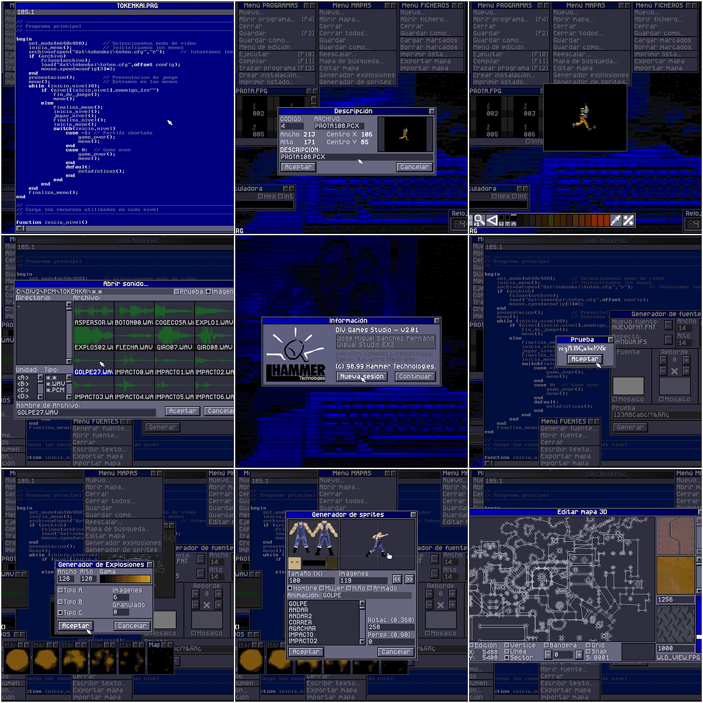

# What is DIV Games Studio?

###### Wikipedia page: https://es.wikipedia.org/wiki/DIV_Games_Studio

Maybe was one of the first game engines for the public. **DIV Games Studio** is a complete solution to develop games for **MS-DOS** and published in 1997 (DIV1) and 1998 (DIV2). 

Is a full windows graphic environment with tools for creation and editing 2D graphics (with a complete drawing suit), particle FX, character animations, font character sets, sounds effects and a complete language programming with a syntax between **Pascal** and **C**, including an integrated debugger and a full complete documentation with a lot of tutorials and samples. 

This engine allow to develop common 2D games with a full of advanced graphic features, and pseudo 3D games using the [Mode7](https://en.wikipedia.org/wiki/Mode_7) and later, with DIV2, the Mode8 (3D feature like the original Doom).

**DIV Games Studio** was very popular at the end of ninetys and early 2000. Was the start point of an entire generation of game developers of nowdays. During the years, the community was develop a multiple forks like [Fenix Project](https://web.archive.org/web/20071012230137/http://fenix.divsite.net/) (with multiple flavours), CDiv, [Div GO](https://www.divgo.net/), [Gemix Studio](http://www.gemixstudio.com/), [Bennu GD](https://www.bennugd.org/), or [PixTudio](https://pixtudio.org/).

Currently exists 2 projects to bring it to live again:
* [Div DX / DIV Games Studio 3](https://github.com/DIVGAMES/DIV-Games-Studio) - A port of DIV Games Studio 2 to modern systems (running on Windows, Linux and Mac natively) but keeping the all original features of DIV Games Studio 2. One of the interested features, including the fix of most of the existing bugs on original DIV2, is the posibility of export the games natively to multiple systems, including Android, HTML5 and some consoles. This project has still in beta and seems to be abandoned since 2016.
* [DIV Games Studio 2.02](https://github.com/vii1/DIV) - A reconstruction and fixing of the original DIV Games Studio 2 (v 2.01) for MS-DOS. This is an active project today where the developers want to fix the multiple bugs in the language programming and engine, improve the tools, and, maybe in a future, create a version for Amiga OS.

**DIV Games Studio** if fully functional on [DOSBox](https://www.dosbox.com/). You can download **DIV Games Studio 2** ISO from [Archive.org](https://archive.org/details/div-games-studio-2) as abandoneware.

