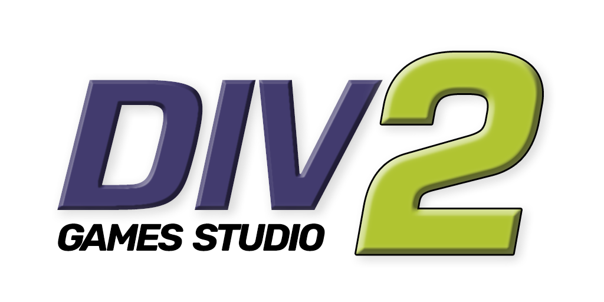

# DIV Games Studio 2 logo recreation
###### By José Miguel Sánchez Fernández

# Licence
 This work is licensed under a <a rel="license" href="http://creativecommons.org/licenses/by/4.0/">Creative Commons Attribution 4.0 International License</a>.

# Description
This folder contains:
* The **PSD** source file.
* The **PNG** exported image, ready to use.
* The **fonts** used to recreate the original **DIV Games Studio 2** logo.

The logo is ready to use in light and dark GitHub theme styles.

# Font sources
- **Rubik**: https://fonts.google.com/specimen/Rubik
- **Saira**: https://fonts.google.com/specimen/Saira
- **Square721 BT**: included with **Adobe Photoshop** and also available on multiples webs by free.
